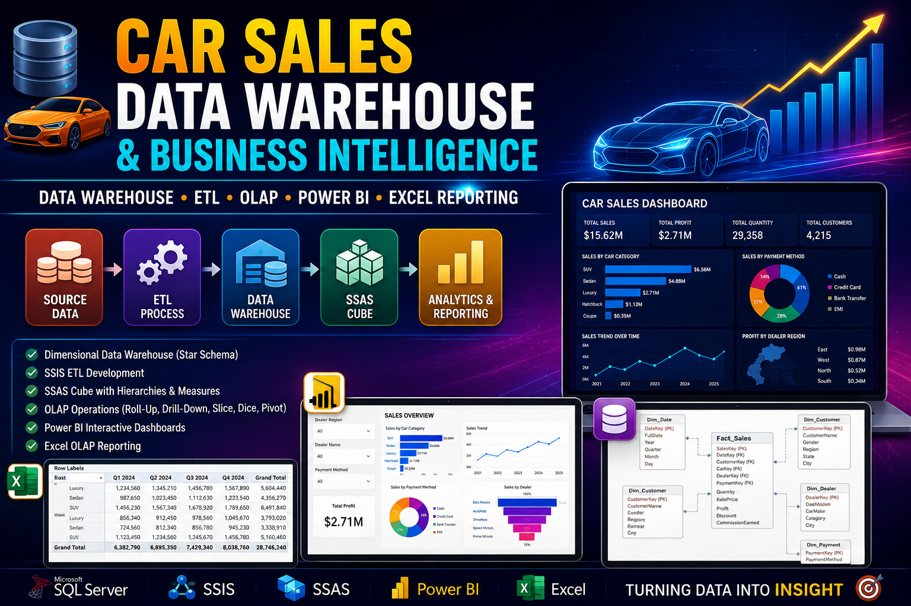

# 📊 Car Sales OLAP Analytics & Business Intelligence Platform

<p align="center">
  
</p>

<p align="center">
  <strong>SSAS Cube Development • OLAP Analytics • Power BI Dashboards • Excel Reporting</strong>
</p>

---
Car Sales OLAP Analytics is a SQL Server Analysis Services (SSAS) and Power BI analytics project built on top of a dimensional data warehouse created from automotive sales data. The project demonstrates multidimensional modeling, OLAP cube development, Excel-based analytical reporting, and interactive Power BI dashboards for business intelligence and decision-making.

The solution includes an SSAS multidimensional cube, Excel OLAP reports, Power BI dashboards, dimension hierarchies, and demonstrations of core OLAP operations including roll-up, drill-down, slice, dice, pivot, and drill-through analysis.


---

## 📌 Project Overview

The project extends the CarSales Data Warehouse by providing a multidimensional analytical layer and reporting environment.

1. Sales data is stored in the `CarSales_DW` dimensional warehouse.
2. SQL Server Analysis Services (SSAS) is used to create the `CarSales_Cube`.
3. Dimension hierarchies are implemented for Date, Customer, and Car analysis.
4. Microsoft Excel is connected to the cube for OLAP analysis using PivotTables.
5. Power BI dashboards provide interactive reporting and business insights.

---

## ✨ Key Features

- Built an SSAS multidimensional cube using SQL Server Analysis Services.
- Created dimensions and hierarchies for customer, vehicle, dealer, payment, and date analysis.
- Implemented roll-up, drill-down, slice, dice, and pivot operations.
- Developed Excel OLAP reports connected directly to the cube.
- Built interactive Power BI dashboards with cascading slicers.
- Implemented drill-through reporting for transaction-level analysis.
- Enabled hierarchical navigation for time-based sales analysis.

---

## 🛠️ Technology Stack

- Microsoft SQL Server
- SQL Server Analysis Services (SSAS)
- SQL Server Data Tools (SSDT)
- Visual Studio
- Microsoft Excel
- Power BI
- OLAP Cube Design
- Dimensional Modeling
- Business Intelligence

---

## 📂 Repository Structure

```text
.
|-- CubeProject/            SSAS multidimensional project
|-- PowerBIReports/         Power BI report files (.pbix)
|-- ExcelReports/           Excel OLAP reports
|-- Screenshots/            OLAP and dashboard screenshots
|-- Documentation/          Assignment report and diagrams
`-- README.md
```

---

## 🗄️ Data Warehouse Source

The cube uses the `CarSales_DW` data warehouse created in Assignment 1.

### Fact Table

- Fact_Sales

### Dimension Tables

- Dim_Date
- Dim_Customer
- Dim_Car
- Dim_Dealer
- Dim_Payment

The warehouse contains approximately 100,000 sales records used for analytical processing.

---

## 🧊 SSAS Cube

The `CarSales_Cube` was developed using SQL Server Analysis Services (SSAS).

### Measures

- Quantity
- Sale Price
- Cost
- Profit
- Discount
- Commission Earned
- Fact Sales Count

### Dimensions

- Date
- Customer
- Car
- Dealer
- Payment

---

## 📈 Dimension Hierarchies

### Date Hierarchy

```text
Year
 └── Quarter
      └── Month
           └── Day
```

### Car Hierarchy

```text
Category
 └── Car Make
      └── Car Model
           └── Car Year
```

### Customer Hierarchy

```text
Region
 └── State
      └── Customer Name
```

These hierarchies support efficient roll-up and drill-down analysis within the cube.

---

## 🔍 OLAP Operations Demonstrated

### Roll-Up

Aggregates detailed sales data into summarized business views.

Examples:

- Sales by Category
- Sales by Region
- Sales by Year

### Drill-Down

Expands summarized information into detailed data.

Examples:

- Year → Quarter → Month
- Category → Make → Model

### Slice

Filters cube data using a single dimension.

Example:

```text
Payment Method = Cash
```

### Dice

Filters cube data using multiple dimensions.

Example:

```text
Payment Method = Cash
Region = West
Year = 2024
```

### Pivot

Changes the orientation of analytical views to compare measures from different perspectives.

---

## 📊 Excel OLAP Reporting

Microsoft Excel PivotTables were connected directly to the SSAS cube.

Analysis includes:

- Customer Analysis
- Car Category Analysis
- Regional Sales Analysis
- Payment Method Analysis
- Time-Based Sales Trends

---

## 📉 Power BI Reports

### Report 1 – Matrix Report

Provides sales analysis by:

- Dealer Region
- Vehicle Category
- Year

Measures:

- Total Sales
- Quantity Sold

### Report 2 – Interactive Dashboard

Includes:

- Cascading Slicers
- Clustered Bar Chart
- Funnel Chart
- Doughnut Chart
- KPI Cards
- Line Chart

Provides insights into:

- Dealer Performance
- Payment Distribution
- Profitability
- Sales Trends

### Report 3 – Drill-Down Analysis

Allows navigation through:

```text
Year → Quarter → Month
```

for detailed trend exploration.

### Report 4 – Drill-Through Analysis

Provides transaction-level details for selected dealers, including:

- Customer Information
- Vehicle Information
- Sales Metrics
- Payment Details

---

## 📋 Prerequisites

- Microsoft SQL Server
- SQL Server Analysis Services (SSAS)
- Visual Studio / SSDT
- Microsoft Excel
- Power BI Desktop

---

## 🚀 Setup

1. Restore or create the `CarSales_DW` database.
2. Open the SSAS project in Visual Studio.
3. Deploy and process the cube.
4. Connect Excel to `CarSales_Cube`.
5. Open Power BI reports in Power BI Desktop.
6. Refresh the dataset connections if required.

---

## 📈 Business Analysis Areas

The cube and reports support analysis such as:

- Sales Performance Trends
- Dealer Performance Analysis
- Regional Sales Distribution
- Customer Segmentation
- Vehicle Category Performance
- Payment Method Analysis
- Profitability Analysis
- Time-Based Business Insights

---


## 📝 Notes

- The project uses a Star Schema data warehouse designed in Assignment 1.
- The SSAS cube supports multidimensional analytical processing (OLAP).
- Power BI and Excel reports are connected to the cube for interactive business analysis.
- The project demonstrates industry-standard Business Intelligence concepts including OLAP cubes, hierarchies, drill-down analysis, drill-through reporting, and dashboard development.
